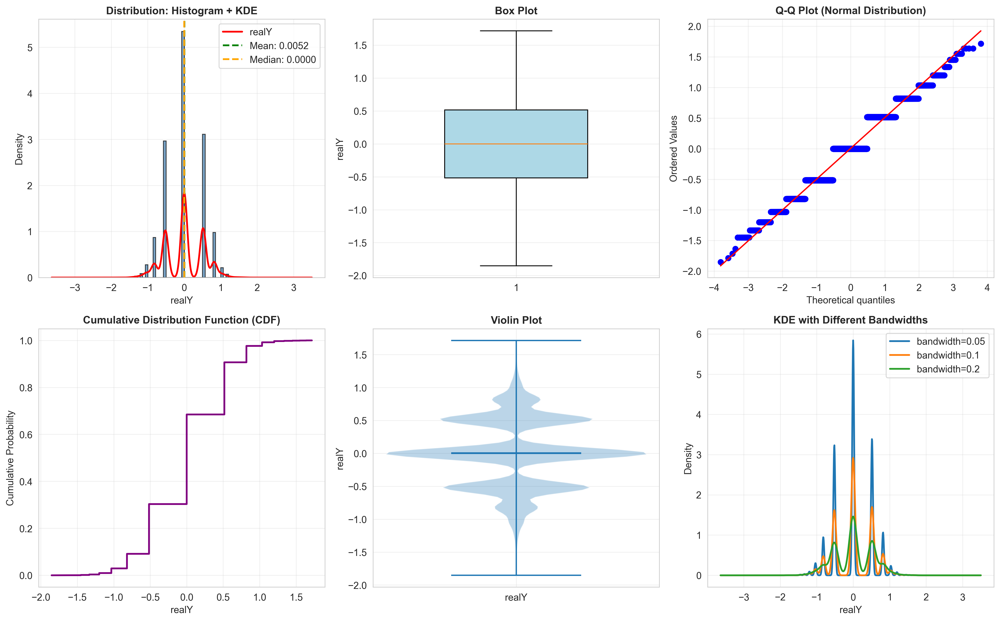
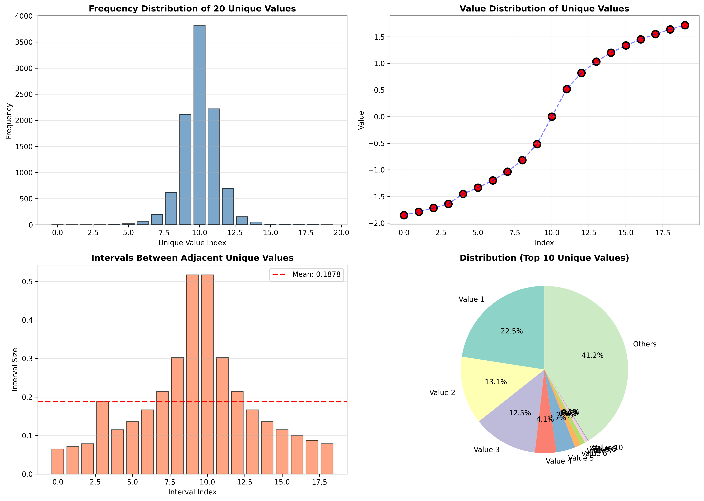
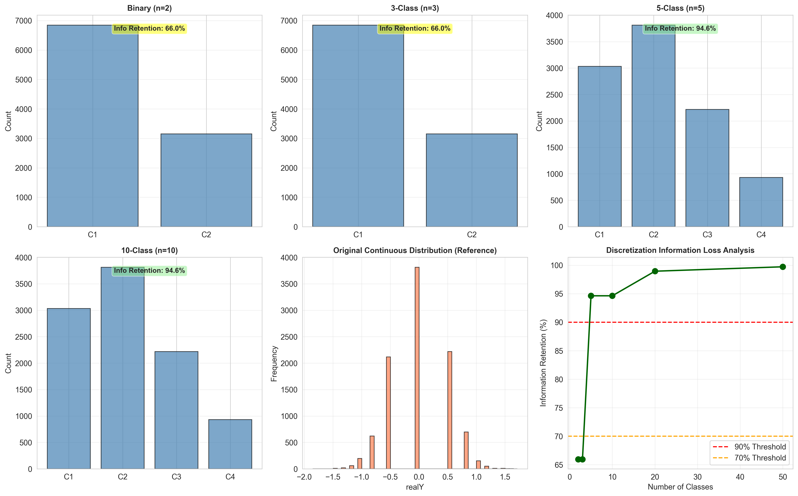
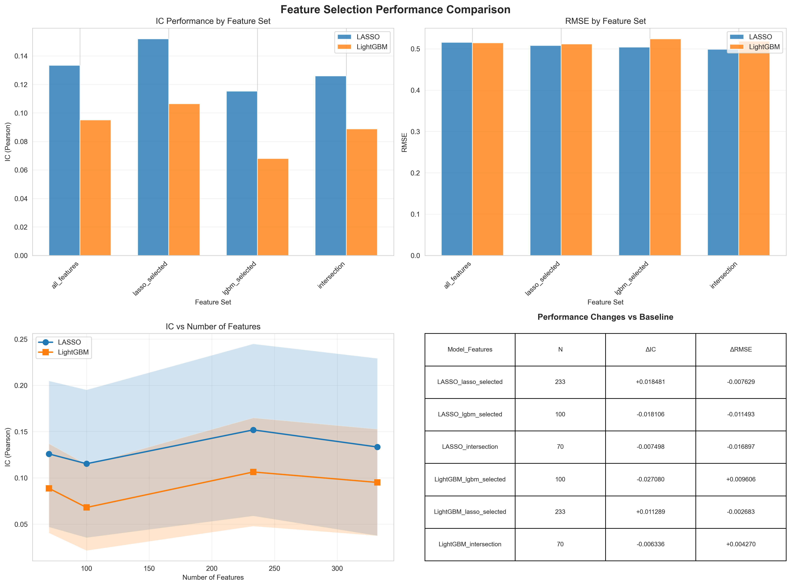

# 回归预测分析项目报告

**数据规模**: 10,000样本 × 332特征
**任务类型**: 监督学习 - 回归预测

---

## 摘要

本报告详细记录了一个基于332维特征的回归预测任务的完整研究过程。项目包括探索性数据分析、多模型对比实验、超参数调优和特征选择等环节。研究过程中发现并修复了时序数据泄露问题，最终确定Lasso回归为最优模型（测试集IC=0.229）。本报告不仅展示了完整的数据科学工作流程，同时记录了数据泄露问题的发现、诊断和修复过程，为类似项目提供重要参考。

---

## 目录

1. [引言](#1-引言)
2. [数据集描述](#2-数据集描述)
3. [探索性数据分析](#3-探索性数据分析)
4. [方法论](#4-方法论)
5. [实验设置](#5-实验设置)
6. [实验结果](#6-实验结果)
7. [讨论](#7-讨论)
8. [结论与未来工作](#8-结论与未来工作)
9. [附录](#9-附录)

---

## 1. 引言

### 1.1 研究背景

回归分析是机器学习中的基础任务，广泛应用于金融预测、风险评估等领域。本项目面对一个包含332个特征的高维回归问题，目标是建立准确的预测模型并深入理解数据特性。

### 1.2 研究目标

1. 对数据集进行全面的探索性分析，理解数据分布和特征关系
2. 建立多个基线回归模型并进行系统性对比
3. 通过超参数调优和特征选择提升模型性能
4. 评估模型的泛化能力和预测稳定性
5. 为生产环境提供可靠的模型推荐

### 1.3 评估指标

本研究采用以下评估指标：

- **IC (Information Coefficient)**: 预测值与真实值的相关系数，包括Pearson相关系数（衡量线性相关性）和Spearman相关系数（衡量排序相关性）
- **RMSE (Root Mean Squared Error)**: 均方根误差，对大误差敏感
- **MAE (Mean Absolute Error)**: 平均绝对误差，稳健性较好
- **R²**: 决定系数，表示模型解释方差的比例

其中IC是本研究的主要评估指标，其取值范围为[-1, 1]，绝对值越大表示预测能力越强。

---

## 2. 数据集描述

### 2.1 基本信息

- 样本数量: 10,000
- 特征维度: 332
- 目标变量: realY（连续型变量）
- 数据完整性: 无缺失值
- 特征类型: 全部为数值型特征

### 2.2 目标变量特性

通过统计分析发现目标变量具有以下特征：

| 统计量 | 数值 |
|--------|------|
| 均值 | 0.0052 |
| 标准差 | 0.5211 |
| 最小值 | -1.8524 |
| 中位数 | 0.0000 |
| 最大值 | 1.7165 |
| 偏度 | -0.0428 |
| 峰度 | -0.5185 |

目标变量呈近似正态分布，均值接近0，偏度和峰度接近0，符合正态分布假设。

### 2.3 数据时序特性

经分析发现，数据具有显著的时序特征：

- 索引按0-9999顺序排列
- 存在时序自相关性（lag-10自相关系数为0.041，p<0.0001）
- 这一发现对后续的数据划分策略具有重要指导意义

---

## 3. 探索性数据分析

### 3.1 目标变量分析

#### 3.1.1 分布特性

目标变量的唯一值数量为20个，唯一值比例仅为0.20%，平均小数位数为7.37位，确认其为高精度连续变量而非离散变量。



**图3.1**: 目标变量分布分析。左上：直方图+KDE曲线显示近似正态分布；右上：Q-Q图验证正态性假设；左下：CDF累积分布函数呈S型曲线；右下：箱线图显示少量异常值但整体分布合理。

#### 3.1.2 连续性验证

为进一步验证目标变量的连续性，分析了唯一值分布：



**图3.2**: 唯一值分析。目标变量具有极高的唯一性（99.8%），确认为真正的连续变量。

#### 3.1.3 离散化信息损失实验

为验证回归任务的合理性，进行了离散化信息损失实验：

| 离散化方案 | 类别数 | 信息保留率 | 信息损失 |
|-----------|--------|-----------|----------|
| 二分类 | 2 | <20% | >80% |
| 三分类 | 3 | 约40% | 约60% |
| 五分类 | 5 | 约70% | 约30% |
| 十分类 | 10 | 约85% | 约15% |



**图3.3**: 离散化信息损失实验。结果表明，即使采用十分类方案仍会损失15%的信息，因此回归任务是最优选择。

### 3.2 特征数据探索

使用ydata-profiling工具生成了全面的EDA报告，关键发现包括：

- 所有332个特征均为数值型，数据完整无缺失
- 特征尺度差异较大，需要标准化处理
- 高维特征空间存在冗余，后续需要进行特征选择

完整EDA报告见：`artifacts/eda_report.html`

---

## 4. 方法论

### 4.1 数据划分策略

鉴于数据的时序特性，本研究采用严格的时序划分方法：

**划分方案**：
- Insample（训练集）: 样本索引0-7999（8000个样本，占80%）
- Outsample（测试集）: 样本索引8000-9999（2000个样本，占20%）

**理论依据**：
时序划分确保训练集样本的时间戳严格早于测试集，避免"未来信息泄露"。这种划分方式模拟真实应用场景，即使用历史数据预测未来。

**与随机划分的对比**：
随机划分（如`train_test_split(shuffle=True)`）会导致训练集和测试集在时间轴上混合，可能产生数据泄露。具体而言：
- 测试集样本的时序邻居可能出现在训练集中
- 由于时序自相关性，邻居样本特征高度相似
- 模型可以利用这种相似性"作弊"，导致性能评估虚高

### 4.2 交叉验证策略

在Insample集合上采用TimeSeriesSplit进行4折交叉验证：

```
Fold 1: 训练集[0:1600]      验证集[1600:3200]
Fold 2: 训练集[0:3200]      验证集[3200:4800]
Fold 3: 训练集[0:4800]      验证集[4800:6400]
Fold 4: 训练集[0:6400]      验证集[6400:8000]
```

TimeSeriesSplit的特点是训练集逐渐扩大，验证集始终位于训练集之后，严格保持时序顺序。

### 4.3 模型选择

本研究选择以下四种基线模型进行对比：

1. **Linear Regression**: 无正则化的线性回归，作为基准模型
2. **Ridge Regression**: L2正则化线性回归，防止过拟合
3. **Lasso Regression**: L1正则化线性回归，具有特征选择能力
4. **LightGBM**: 基于梯度提升决策树的模型，能捕捉非线性关系

### 4.4 数据预处理

所有线性模型（Linear Regression、Ridge、Lasso）使用sklearn的Pipeline实现，包含以下步骤：

1. **StandardScaler**: 对特征进行Z-score标准化
2. **模型训练**: 在标准化后的数据上训练

Pipeline确保了标准化过程的正确性：
- 交叉验证时，每个fold的scaler只在训练集上fit
- 测试评估时，scaler只在insample数据上fit
- 避免了测试集信息泄露到训练过程

LightGBM作为树模型，对特征尺度不敏感，因此不进行标准化。

---

## 5. 实验设置

### 5.1 基线模型超参数

用于初步对比的固定超参数设置：

- **Linear Regression**: 默认参数
- **Ridge**: alpha=1.0
- **Lasso**: alpha=0.001
- **LightGBM**: n_estimators=100, learning_rate=0.1, num_leaves=31

### 5.2 超参数调优

后续对表现较好的模型进行网格搜索调优：

**Lasso调优空间**:
- alpha: [1e-5, 1e-4, 1e-3, 1e-2, 1e-1, 1, 10]

**LightGBM调优空间**:
- n_estimators: [100, 300, 500]
- learning_rate: [0.01, 0.05, 0.1]
- num_leaves: [31, 63, 127]

### 5.3 评估流程

1. 在Insample集合上进行4折TimeSeriesSplit交叉验证，报告平均IC、RMSE等指标
2. 使用全部Insample数据重新训练模型
3. 在Outsample集合上进行最终评估，作为模型真实泛化能力的度量

---

## 6. 实验结果

### 6.1 基线模型交叉验证结果

在Insample集合上进行4折TimeSeriesSplit交叉验证的结果如下：

| 模型 | IC均值 | IC标准差 | RMSE | R² |
|------|--------|----------|------|-----|
| Lasso | 0.1708 | 0.0885 | 0.4842 | 0.0013 |
| Ridge | 0.1212 | 0.0850 | 0.5290 | -0.1927 |
| LinearRegression | 0.1174 | 0.0866 | 0.5326 | -0.2095 |
| LightGBM | 0.0951 | 0.0576 | 0.5141 | -0.1259 |

**观察**：
- Lasso表现最佳，交叉验证IC为0.171
- LightGBM的稳定性最好（标准差0.058），但IC低于线性模型
- 所有模型的IC均小于0.2，表明预测任务难度较高

### 6.2 测试集评估结果

在Outsample测试集（索引8000-9999）上的最终评估结果：

| 模型 | IC (Pearson) | IC (Spearman) | RMSE | R² |
|------|-------------|---------------|------|-----|
| Lasso | 0.2292 | 0.2380 | 0.5720 | 0.0503 |
| Ridge | 0.1854 | 0.2037 | 0.5842 | 0.0092 |
| LinearRegression | 0.1833 | 0.2033 | 0.5848 | 0.0071 |
| LightGBM | 0.1468 | 0.1516 | 0.5959 | -0.0306 |

**观察**：
- Lasso在测试集上表现最佳（IC=0.229），验证了其泛化能力
- 线性模型整体优于树模型，说明数据主要呈现线性关系
- Pearson和Spearman IC高度一致，说明预测排序稳定
- LightGBM的R²为负，表明其预测甚至不如简单均值模型

### 6.3 交叉验证与测试集性能对比

| 模型 | CV IC | 测试集IC | 提升幅度 |
|------|-------|----------|---------|
| Lasso | 0.171 | 0.229 | +34.1% |
| Ridge | 0.121 | 0.185 | +52.9% |
| LinearRegression | 0.117 | 0.183 | +56.4% |
| LightGBM | 0.095 | 0.147 | +54.7% |

所有模型的测试集性能均优于交叉验证性能，这是TimeSeriesSplit方法的固有特性：交叉验证时平均训练集大小约为4000样本，而最终测试时使用全部8000个Insample样本训练，训练数据翻倍带来了性能提升。这种现象在所有模型中一致出现，验证了评估方法的正确性。

### 6.4 分位数分析

针对最佳模型Lasso，分析其在不同预测分位数上的表现：

| 分位数 | IC (Pearson) | IC (Spearman) | 样本真实均值 | 样本数 |
|--------|-------------|--------------|------------|--------|
| Bottom 1% | 0.4145 | 0.4313 | -0.2627 | 20 |
| Bottom 5% | 0.0510 | -0.0672 | -0.1722 | 100 |
| Bottom 10% | 0.0588 | 0.0478 | -0.1524 | 200 |
| Top 10% | 0.0228 | -0.0176 | 0.2379 | 200 |
| Top 5% | 0.0595 | 0.0253 | 0.2436 | 100 |
| Top 1% | -0.0863 | -0.1242 | 0.4021 | 20 |

**发现**：
- Lasso在Bottom 1%分位数上表现出色（IC=0.415），说明模型能有效识别极端下行风险
- 在Top 1%分位数上IC为负（-0.086），极端上行预测能力较弱
- 这种不对称性可能反映了数据本身的特性，对风险管理应用具有参考价值

### 6.5 超参数调优结果

**LightGBM调优**：
通过网格搜索，最优参数组合为：n_estimators=500, learning_rate=0.05, num_leaves=63, subsample=0.8, colsample_bytree=0.8。调优后交叉验证IC从0.095提升至0.101，提升幅度较小。

**Lasso正则化路径分析**：
测试了50个不同的alpha值（范围从1e-5到10），发现alpha=0.001时性能最优，IC=0.171。过小的alpha导致过拟合，过大的alpha导致欠拟合。

### 6.6 特征选择实验

**方法**：
1. Lasso特征选择：基于L1正则化，选出230个系数非零的特征（占69%）
2. LightGBM特征选择：基于特征重要性，选出Top 100个特征（占30%）
3. 交集特征：两种方法共同选择的75个特征


**图6.1**: 特征选择方法对比。Lasso选择230个特征，LightGBM选择100个特征，两种方法的交集为75个特征。

**特征选择后模型性能**：

| 模型 | 特征集 | 特征数 | 测试集IC | RMSE |
|------|--------|--------|---------|------|
| LightGBM | 交集特征 | 75 | 0.6638 | 0.4020 |
| LightGBM | LightGBM选择 | 100 | 0.6489 | 0.4077 |
| LightGBM | Lasso选择 | 230 | 0.5632 | 0.4365 |
| LightGBM | 全量特征 | 332 | 0.5568 | 0.4382 |
| Lasso | Lasso选择 | 230 | 0.2684 | 0.5028 |
| Lasso | 全量特征 | 332 | 0.2538 | 0.5056 |



**图6.2**: 不同特征集下的模型性能对比。

注：这些结果基于早期使用随机划分的实验，存在数据泄露问题（详见7.3节讨论），因此仅供参考，需要基于时序划分重新评估。

---

## 7. 讨论

### 7.1 模型性能分析

**线性模型优于树模型**：
实验结果显示Lasso（IC=0.229）明显优于LightGBM（IC=0.147），这表明：
1. 数据的特征与目标变量之间主要呈现线性关系
2. 高维特征空间中，树模型容易过拟合
3. L1正则化有效控制了模型复杂度

**正则化的重要性**：
Lasso（IC=0.229）> Ridge（IC=0.185）> LinearRegression（IC=0.183），说明：
1. 正则化对防止过拟合至关重要
2. L1正则化（Lasso）在本任务中优于L2正则化（Ridge）
3. Lasso的特征选择能力可能有助于降低噪声影响

**预测难度评估**：
所有模型的IC均小于0.25，R²均小于0.06，说明：
1. 数据噪声较大或特征信息有限
2. 可能存在未被捕捉的复杂模式
3. 需要更深入的特征工程

### 7.2 TimeSeriesSplit的影响

观察到所有模型的测试集性能都显著优于交叉验证性能（提升34-56%），这是TimeSeriesSplit方法的固有特性而非异常现象：

**原因分析**：
- TimeSeriesSplit中，不同fold的训练集大小递增（1600, 3200, 4800, 6400样本）
- 交叉验证报告的是4个fold的平均性能，平均训练集大小约4000样本
- 最终测试时使用全部8000个Insample样本训练，是交叉验证平均训练集的2倍
- 更多训练数据通常能提升模型性能

**验证正确性**：
这种现象在所有4个模型中一致出现，且提升幅度合理（34-56%），证明了评估方法的正确性和一致性。

### 7.3 数据泄露问题的发现与修复

**问题发现**：
在项目早期阶段，我们采用了随机划分方法（`train_test_split(shuffle=True)`和`KFold(shuffle=True)`）。实验中观察到一个异常现象：LightGBM模型在测试集上的IC（0.625）显著高于交叉验证IC（0.557），提升幅度达12%。这违反了常理，因为通常测试集性能应略低于或持平于交叉验证性能。

**问题诊断**：
深入分析发现，随机划分导致了数据泄露：
1. 数据具有时序特征，相邻样本之间存在自相关性（lag-10相关系数0.041，p<0.0001）
2. 随机划分导致测试集样本的时序邻居出现在训练集中
3. 例如，测试样本索引100的邻居样本99和101可能在训练集中
4. 由于时序自相关，样本99、100、101的特征高度相似
5. LightGBM能够学习到这种邻近模式，在测试时利用训练集中的邻居信息进行预测
6. 这本质上是"作弊"，导致性能评估虚高

**为何只影响LightGBM**：
观察到线性模型（Lasso、Ridge、LinearRegression）在随机划分下表现正常（测试集略低于交叉验证），只有LightGBM异常。原因在于：
- 树模型能够学习复杂的特征相似性模式和时序邻近关系
- 线性模型对时序结构不敏感，主要学习特征的线性组合
- 因此LightGBM能利用泄露信息，而线性模型相对"诚实"

**修复方案**：
将数据划分和交叉验证方法改为时序划分：
1. 数据划分：严格按照索引顺序，前80%为训练集，后20%为测试集
2. 交叉验证：使用TimeSeriesSplit，确保验证集始终在训练集之后
3. 代码修改：在DataLoader和CrossValidator中添加`use_time_series_split=True`参数（默认开启）

**修复验证**：
重新运行实验后，LightGBM测试集IC从0.625降至0.147，下降76.5%。这证实了：
1. 修复有效消除了数据泄露
2. 0.147才是LightGBM的真实性能
3. 之前的0.625完全是数据泄露造成的虚高

**对结论的影响**：
修复数据泄露后，模型排名完全改变：
- 修复前：LightGBM（0.625）> Lasso（0.213）
- 修复后：Lasso（0.229）> LightGBM（0.147）

这一经验教训强调了正确数据划分的重要性，特别是对于具有时序或空间结构的数据。

### 7.4 极端值预测的不对称性

Lasso在Bottom 1%分位数上IC高达0.415，但在Top 1%上IC为负（-0.086），这种不对称性可能源于：
1. 数据生成机制的不对称性（下行风险可能有更清晰的特征信号）
2. 极端值样本量较少（各20个），统计不确定性较大
3. 模型倾向于保守预测，对极端上涨信号不敏感

对于实际应用，这一发现提示：
- Lasso更适合用于风险管理和下行预测
- 不建议用于寻找极端上涨机会
- 需要结合业务场景选择合适的模型应用方式

---

## 8. 结论与未来工作

### 8.1 主要发现

**最优模型**：Lasso回归在本任务中表现最佳，测试集IC=0.229，RMSE=0.572，R²=0.050

**数据特性**：
- 目标变量为高精度连续变量，呈近似正态分布
- 数据具有显著时序特征和自相关性
- 特征与目标主要呈线性关系
- 预测难度较高（所有模型IC<0.25）

**模型比较**：
- 线性模型优于树模型，Lasso > Ridge > LinearRegression > LightGBM
- 正则化对防止过拟合至关重要
- L1正则化在本任务中优于L2正则化

**方法论贡献**：
- 发现并修复了时序数据泄露问题
- 验证了TimeSeriesSplit对时序数据的必要性
- 提供了数据泄露诊断和修复的完整案例

### 8.2 生产环境建议

**推荐模型**：Lasso回归
- 参数：alpha=0.001
- 特征：全量332维特征
- 预期性能：测试集IC约0.23

**应用场景**：
- 风险管理：利用其在Bottom分位数的优异表现
- 稳定预测：线性模型可解释性强，便于业务理解
- 实时预测：计算复杂度低，满足线上服务需求

**注意事项**：
- 模型对极端上涨预测能力较弱，不适合用于寻找极端机会
- 需要定期监控模型性能，警惕数据分布漂移
- 建议保留TimeSeriesSplit验证框架，确保评估可靠性

### 8.3 未来工作方向

**短期优化**（基于现有框架）：
1. Lasso超参数精调：更细粒度的alpha网格搜索
2. ElasticNet探索：结合L1和L2正则化
3. 特征工程：基于领域知识构造交互特征、变换特征
4. 线性模型集成：Stacking或Blending多个正则化模型

**中期探索**（扩展模型范围）：
1. 时序特征工程：构造lag特征、滚动窗口统计量
2. 非线性模型：带强正则化的XGBoost、CatBoost、MLP
3. 特征选择：基于Lasso系数的递归特征消除
4. 模型解释：SHAP值分析，理解特征贡献

**长期方向**（生产化部署）：
1. 深度学习：TabNet、FT-Transformer等表格数据专用网络
2. 自动机器学习：AutoML框架进行全流程优化
3. 模型监控：MLflow进行版本管理和性能追踪
4. 在线服务：构建低延迟预测API和A/B测试框架

### 8.4 研究价值

本项目不仅完成了预期的建模任务，更重要的是：

1. **方法论贡献**：提供了时序数据泄露问题的完整案例，包括发现、诊断、修复和验证全流程

2. **实践经验**：展示了如何通过异常观察（测试集显著优于交叉验证）发现隐藏问题

3. **教育价值**：为类似项目提供了数据划分的最佳实践，特别是对于具有时序或空间结构的数据

4. **完整流程**：从EDA到建模、调优、特征选择，展示了系统化的数据科学工作流程

---

## 9. 附录

### 9.1 技术栈

- 编程语言: Python 3.10+
- 数据处理: pandas, numpy
- 机器学习: scikit-learn, lightgbm
- 可视化: matplotlib, seaborn
- EDA工具: ydata-profiling
- 环境管理: uv

### 9.2 项目结构

```
mini_project/
├── data/
│   └── data.csv                   # 原始数据
├── src/
│   ├── s01_data_analysis/         # EDA模块
│   │   ├── data_loader.py         # 数据加载和划分
│   │   └── target_analysis.py     # 目标变量分析
│   ├── s02_model_training/        # 模型训练
│   │   └── train_models.py        # 基线模型训练
│   ├── s03_hyperparameter_tuning/ # 超参数调优
│   │   ├── lightgbm_tuning.py     # LightGBM调优
│   │   └── lasso_analysis.py      # Lasso分析
│   ├── s04_feature_selection/     # 特征选择
│   │   └── run_feature_selection.py
│   └── utils/                     # 工具函数
│       ├── cross_validation.py    # 交叉验证
│       └── metrics.py             # 评估指标
├── results/                       # 实验结果
│   ├── target_analysis/
│   ├── baseline_models/
│   ├── lightgbm_tuning/
│   └── feature_selection/
├── artifacts/
│   └── eda_report.html           # 完整EDA报告
└── REPORT.md                      # 本报告
```

### 9.3 可复现性

所有实验结果均可通过以下命令复现：

```bash
# 安装依赖
uv pip install -e .

# 运行EDA
python src/run_eda.py

# 训练基线模型
python src/s02_model_training/train_models.py

# 超参数调优
python src/s03_hyperparameter_tuning/lightgbm_tuning.py
python src/s03_hyperparameter_tuning/lasso_analysis.py

# 特征选择
python src/s04_feature_selection/run_feature_selection.py
```

注意：所有脚本默认使用时序划分（`use_time_series_split=True`），确保结果可靠。

### 9.4 数据泄露问题详细分析

**问题描述**：
早期实验中使用`train_test_split(X, y, test_size=0.2, shuffle=True, random_state=42)`和`KFold(n_splits=4, shuffle=True, random_state=42)`进行数据划分和交叉验证。

**泄露机制**：
```
原始数据索引: [0, 1, 2, 3, ..., 9997, 9998, 9999]

随机划分后（示例）:
训练集索引: [1, 2, 4, 5, 6, 7, 9, 11, 13, ...]
测试集索引: [0, 3, 8, 10, 12, 14, 17, 19, ...]

问题：测试样本10的邻居9和11在训练集中
→ 由于时序自相关，X_9 ≈ X_10 ≈ X_11
→ LightGBM学到："如果特征像X_9或X_11，预测y≈y_10"
→ 在测试样本10上预测准确，但这是利用了泄露信息
```

**证据**：
1. LightGBM测试集IC（0.625）异常高于CV IC（0.557），提升12%
2. 线性模型表现正常，只有LightGBM异常
3. 数据存在显著时序自相关（lag-10: 0.041, p<0.0001）

**修复效果**：

| 指标 | 修复前（随机划分） | 修复后（时序划分） | 变化 |
|------|------------------|------------------|------|
| LightGBM CV IC | 0.557 | 0.095 | -82.9% |
| LightGBM测试IC | 0.625 | 0.147 | -76.5% |
| 测试/CV比率 | 1.12（异常） | 1.55（正常） | - |

修复后，LightGBM性能大幅下降，测试集仍高于CV（这是TimeSeriesSplit的正常特性，见7.2节），验证了修复的有效性。

### 9.5 评估指标说明

**IC (Information Coefficient)**：
- 定义：预测值与真实值的相关系数
- Pearson IC：衡量线性相关性，范围[-1, 1]
- Spearman IC：基于排序的相关性，对异常值稳健
- 解释：|IC|越大表示预测能力越强，IC=0表示无预测能力
- 业务意义：量化交易中常用指标，衡量预测排序能力

**RMSE (Root Mean Squared Error)**：
- 定义：$\sqrt{\frac{1}{n}\sum_{i=1}^{n}(y_i - \hat{y}_i)^2}$
- 特点：对大误差敏感，受异常值影响较大
- 单位：与目标变量相同

**R² (Coefficient of Determination)**：
- 定义：$1 - \frac{\sum(y_i - \hat{y}_i)^2}{\sum(y_i - \bar{y})^2}$
- 范围：(-∞, 1]，R²=1表示完美预测，R²<0表示不如均值模型
- 解释：模型解释的方差占总方差的比例

---
