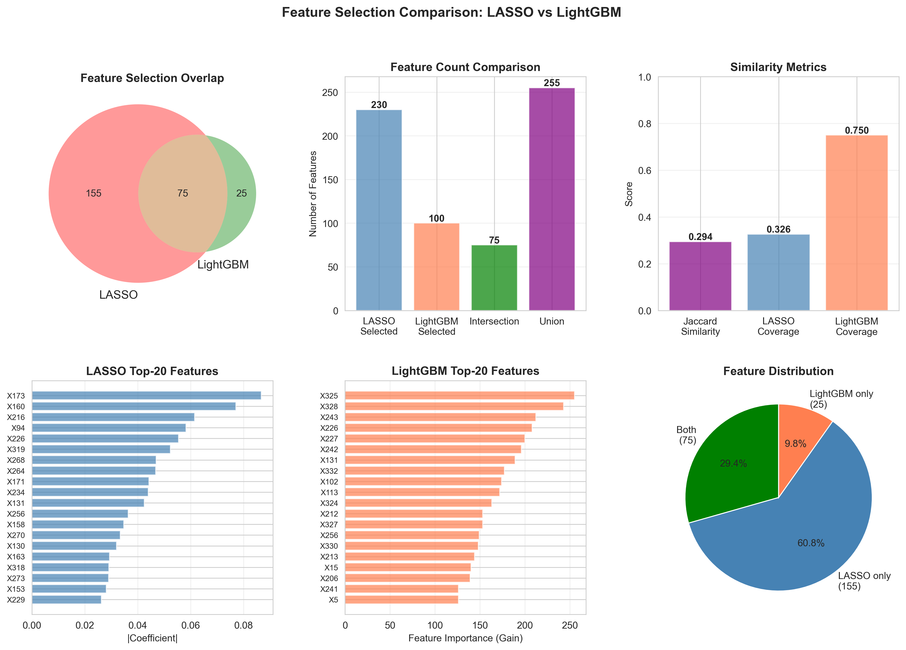

# 特征筛选对比报告

## 1. 集合统计

| 指标 | 数值 |
|------|------|
| LASSO筛选特征数 | 233 |
| LightGBM筛选特征数 | 100 |
| 交集特征数 | 70 |
| 并集特征数 | 263 |
| LASSO独有特征 | 163 |
| LightGBM独有特征 | 30 |

## 2. 相似度指标

| 指标 | 数值 |
|------|------|
| Jaccard相似度 | 0.2662 |
| LASSO覆盖率 | 0.3004 |
| LightGBM覆盖率 | 0.7000 |

## 3. 可视化

## 4. 结论

两个模型筛选的特征差异较大，可能因为模型机制不同导致关注点不同。
